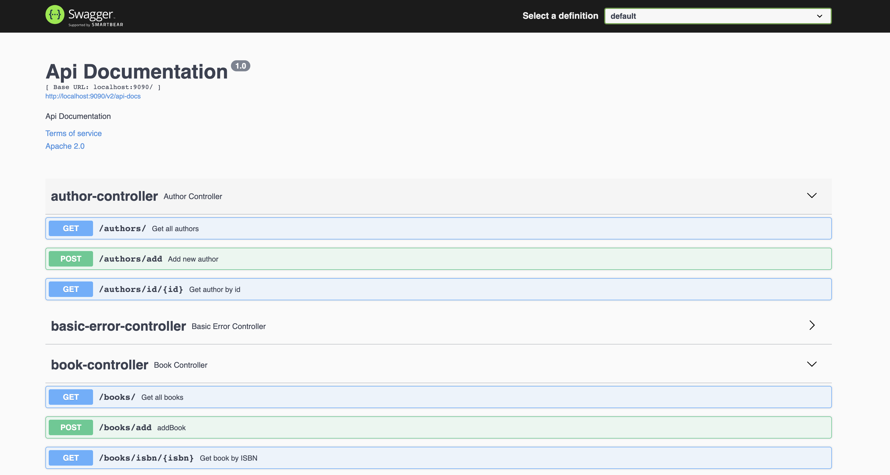
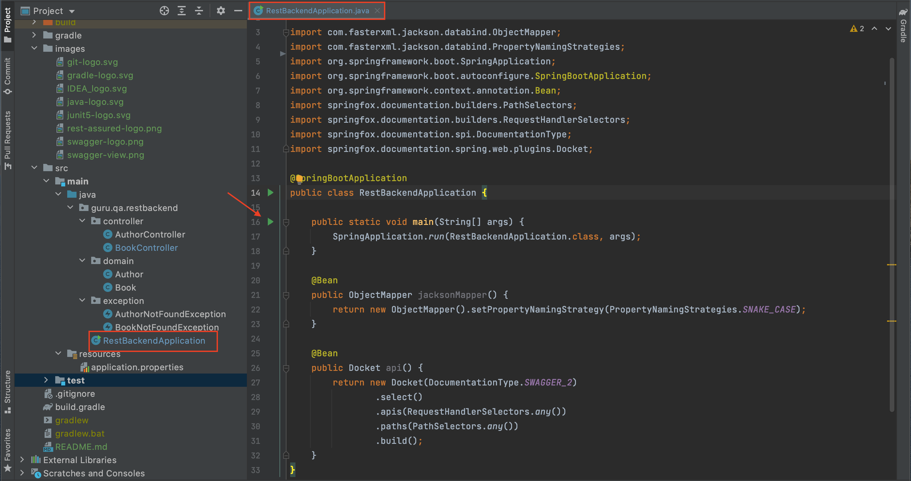
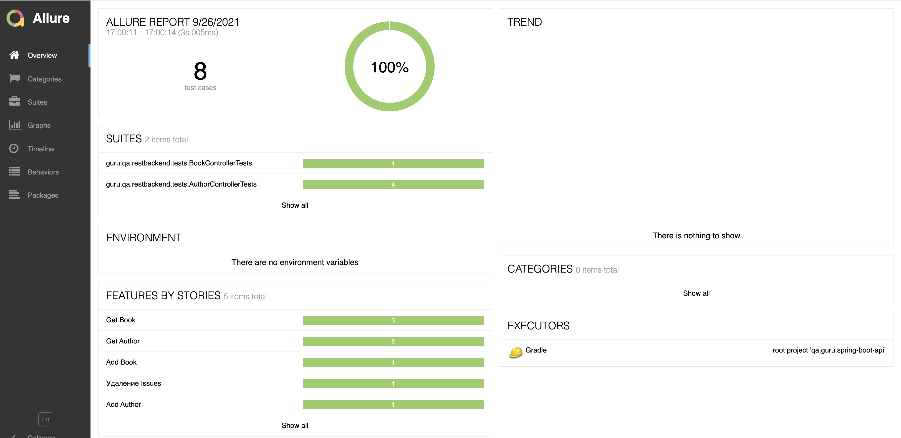
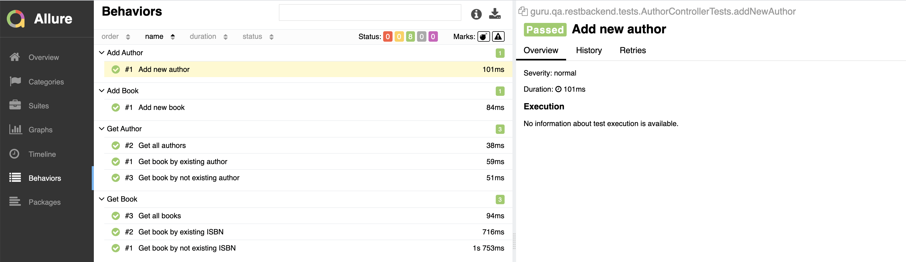

# Проект по созданию тестового REST сервиса и его тестированию

### Используемые технологии и инструменыт:

### Документирование сервиса:

### Запуск сервиса:
Сервис работает локально на порту 9090.
Для запуска сервиса необходимо скачать репозиторий и запустить приложение:

### Реализованы следующие проверки:
- [X] Проверка мининимального значения величины вклада
- [X] Проверка величины дохода по вкладу
- [X] Проверка величины процента по вкладу
- [X] Проверка работы ссылки "Все вопросы и ответы"
- [X] Проверка работы ссылки "Все новости" 
- [X] Проверка заголовка страницы
- [X] Проверка консоли браузера на наличие ошибок

### Запуск тестов с использованием Jenkins  

#### Параметры, необходимые для запуска:

### Allure отчет для отображения результатов тестирования  
#### Общая информация

#### Список тестов c описанием шагов и визуализацией результатов

:heart: <a target="_blank" href="https://qa.guru">qa.guru</a> 
:blue_heart: <a target="_blank" href="https://t.me/qa_automation">t.me/qa_automation</a>
